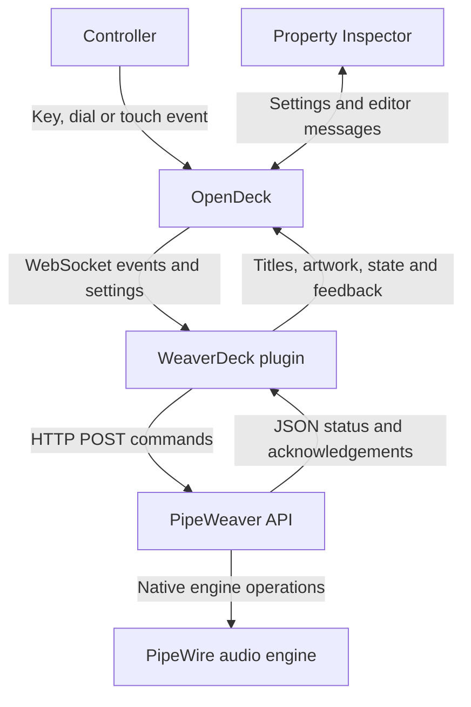

# Communication

WeaverDeck is a Node.js plugin launched by OpenDeck. It receives control events from OpenDeck over a local WebSocket and sends audio commands exclusively to PipeWeaver's HTTP API. PipeWeaver performs the underlying audio operations.



## Grouped action dispatch (v0.23.0)

OpenDeck stores a group action UUID and a `settings.operation` identifier. `action-groups.js` validates that operation against `action-catalog.json` and adapts incoming events to the existing operation handler, retaining the original context for feedback. Invalid or cross-group selections are rejected. Encoder events resolve to the group's dial operation. Changing settings stops held controls and cancels an active grouped fade before reclassifying the instance and refreshing artwork.

The grouped Property Inspector uses the same registered WebSocket and shared text/layout code as direct inspectors. It saves operation, device/application identity and optional `deviceIcon` fields with the action settings. Scene operations continue to use the Scene engine's existing schema.

Because compact sidebar entries require new UUIDs, `tools/install-grouped-actions.py` runs with OpenDeck closed. It backs up profiles and the installed plugin, maps the 51 old operation UUIDs to six groups (including nested Multi Actions), and installs the verified ZIP. Profile writes and plugin replacement have rollback handling. This migration is performed before OpenDeck loads the new manifest; the runtime itself does not edit profiles.

## OpenDeck connection

OpenDeck starts `com.pipeweaver.opendeck.sdPlugin/plugin.js` with a port and plugin UUID. The plugin connects to `ws://127.0.0.1:<port>` and registers with `registerPlugin`. This port belongs to OpenDeck; it is separate from PipeWeaver's HTTP port.

| Direction | Events | Purpose |
| --- | --- | --- |
| OpenDeck → plugin | `willAppear`, `willDisappear`, `didReceiveSettings` | Track action instances and their saved configuration. Disappearance can mean a page change or removal. |
| OpenDeck → plugin | `keyDown`, `keyUp` | Execute button actions and start/stop eligible held volume repeats. |
| OpenDeck → plugin | `dialRotate`, `dialDown`, `dialUp`, `touchTap` | Encoder movement, press/release and strip touch. |
| Plugin → OpenDeck | `setTitle`, `setImage`, `setState`, `showOk`, `showAlert` | Update key presentation and success/failure feedback. |
| Plugin → OpenDeck | `setFeedback` | Update encoder strip values using the layout declared in the manifest. |
| Inspector ↔ OpenDeck | `registerPropertyInspector`, `getSettings`, `setSettings`, `didReceiveSettings` | Connect the HTML editor and persist per-action settings. |
| Inspector → plugin via OpenDeck | `sendToPlugin` | Request discovery, validation, file/library operations or shared startup settings. |
| Plugin → inspector via OpenDeck | `sendToPropertyInspector` | Return results to the specific action context. |

OpenDeck routes editor messages using the action context. The inspector does not need to talk to PipeWeaver directly: the native plugin handles requests and returns normalized lists/results.

If the OpenDeck WebSocket closes, the plugin reconnects with backoff starting at 1 second and capped at 30 seconds. Held repeats, fades and pending dial input are cleared. Already accepted audio changes are not undone. A socket generation guard prevents superseded connections from processing later events.

### Inspector rendering and selection

The manifest opens the actual action HTML pages directly. Shared scripts apply the action header, Button Text controls and compact dark styling in place. Old profiles using `button-settings.html` navigate to the matching editor through OpenDeck's normal load/connect handshake, preserving settings.

Scene retains nested editor layers. Their frames are sized from content, with resize/mutation observations and a periodic check to keep settings reachable as steps grow or shrink.

The deletion/reselection fix forwards `propertyInspectorDidAppear` and `propertyInspectorDidDisappear` to the matching editor as `inspectorVisibility`. An `inspectorReady` handshake handles registration after the original appearance event. On selection, short temporary scrolls request a repaint, including on pages with no normal scroll range. Styles and scroll positions are restored; deselection/unloading cancels pending work. With `WEAVERDECK_DEBUG=1`, `[Inspector]` logs record selection and redraw dimensions. This workaround was visually confirmed by the user after testing the reported deletion/empty-button sequence.

## PipeWeaver connection

Default endpoint:

```text
http://127.0.0.1:14565/api/command
```

The plugin uses HTTP **POST**, `Content-Type: application/json`, with a JSON command as the body. `PIPEWEAVER_URL` in the plugin process environment can override the URL. The implementation uses Node's HTTP transport; it does not implement an HTTPS client or an authentication configuration UI.

A read-only status request is the JSON string `"GetStatus"`, not a GET request:

```bash
curl --fail --silent --show-error \
  -H 'Content-Type: application/json' \
  --data '"GetStatus"' \
  http://127.0.0.1:14565/api/command
```

A recognized status payload contains `Status` (or the supported `data.Status` wrapper). Its audio profile, configured channels, routes, applications and physical devices feed discovery, validation and button feedback. Mutations normally return an `Ok` acknowledgement; HTTP errors, invalid JSON and command errors are reported in the plugin log.

| Operation | Example JSON body |
| --- | --- |
| Read status | `"GetStatus"` |
| Set a source's mix B volume | `{"Pipewire":{"SetSourceVolume":["source-id","B",40]}}` |
| Set target volume | `{"Pipewire":{"SetVolumeByName":["Headphones",null,40]}}` |
| Set application volume | `{"Pipewire":{"SetApplicationVolume":[123,40]}}` |
| Enable a named route | `{"Pipewire":{"SetRouteByNames":["Browser","Headphones",true]}}` |
| Add a mute destination | `{"Pipewire":{"AddMuteTargetNode":["source-id","TargetB","target-id"]}}` |
| Restart audio | `{"Daemon":"ResetAudio"}` |
| Set buffer size | `{"Daemon":{"SetAudioQuantum":"Quantum512"}}` |
| Restore configured quantum | `{"Daemon":{"SetAudioQuantum":null}}` |

IDs, node numbers and names above are illustrative; runtime values come from PipeWeaver status. The `Pipewire` command-envelope name belongs to PipeWeaver's API. WeaverDeck does not invoke `pactl`, `wpctl`, PipeWire, PulseAudio, WirePlumber or system service commands directly.

### Refresh, timing and recovery

- Routine status refresh is scheduled about three seconds after the previous refresh completes. Commands also request fresh status where needed.
- Concurrent core status refresh callers share the same pending request. Application discovery can reuse status for up to 3.5 seconds, reducing redundant requests.
- HTTP requests have a 4000 ms inactivity timeout. This is not a guarantee of a four-second wall-clock limit for every multi-command action.
- Restart/buffer actions are serialized, wait initially for the reset to begin, then require two successful readiness responses. The polling deadline is approximately 30 seconds; a request already in flight can extend the observed duration. Buffer recovery also checks the requested quantum. Setting the existing buffer is a no-op.
- HTTP 503 responses may occur while PipeWeaver resets. Recovery polling tolerates temporary failures; it does not repeat a potentially accepted restart command.
- Volume fades serialize their updates and verify feedback. Physical-device status is updated separately from command acceptance, so physical fades wait up to 1000 ms for readback after each command. Commands with uncertain acknowledgement are not blindly resent.
- Successful engine recovery does not resume a paused browser video. WeaverDeck has no media-playback control path.

## Identity and Scene execution

Application node IDs change. WeaverDeck saves name, process and device type, normalizes executable paths to basenames and strips trailing ` (deleted)` markers. It prefers matching name and process, then unambiguous process/name fallback within compatible device types. Multiple competing identity groups are rejected; offline configured selections are preserved. Direct actions, visuals, Scene operations and conditions use this identity logic.

Scene application operations may act on multiple streams belonging to the resolved identity; an individual button uses its resolved live application. A running condition means an application is discoverable through PipeWeaver, not merely that its process exists.

Structured Scenes validate before making changes and execute steps in order. Conditions and Stop/Continue policies govern runtime execution. They do not provide rollback. The startup controller uses the same validation and runner after readiness, and executes at most once automatically per plugin process launch.

## Persistent data

| Data | Owner/location | Lifetime |
| --- | --- | --- |
| Button settings and working Scene | OpenDeck action settings | Saved with the profile; action UUIDs remain stable across these updates. |
| Scene Library | `$XDG_DATA_HOME/weaverdeck/scene-library-v1.json` | Shared independently of buttons and plugin-folder replacement. |
| Startup Scene configuration | `$XDG_DATA_HOME/weaverdeck/startup-scene-v1.json` | Includes enabled state, path and delay; deleting the setup button does not disable startup. |
| Previous native Saved Presets | `$XDG_DATA_HOME/weaverdeck/scene-presets-v1.json` | Retained as a migration backup. |
| Exported Scene file | User Downloads directory, or a file the user has moved elsewhere | Portable JSON; loaded/copied into buttons or read at startup from its configured path. |

When `XDG_DATA_HOME` is unset, the base is `~/.local/share`. The plugin reads the startup Scene file again for each run rather than substituting a cached copy. Scene file saving occurs in the native process, avoiding WebView download limitations. Browser-only presets are migrated when still accessible, and cleared only after confirmed native import.

## Source organization

`plugin.js` installs the presentation, Scene, file/library and inspector adapters, then loads the consolidated `plugin-core.js`. Separate modules handle fades, dials, startup, v0.18 audio/mute-destination commands and presentation. Versioned filenames retained inside current inspector layers are active dependencies, not old installable plugin versions. Removing release tags does not remove these runtime dependencies.

Tests run with `node --test tests/*.test.js`. The deterministic ZIP builder is `python3 tools/build-release.py`. ZIP contents are sorted, use fixed timestamps, preserve executable entrypoint modes and are checked against the source bytes.

## Diagnostics and references

OpenDeck collects plugin stdout/stderr, normally under `~/.local/share/opendeck/logs/plugins/` on the tested installation. Normal logs retain startup, preview/validation summaries, Scene start/end, skips, warnings, failures and fade results. Starting OpenDeck with `WEAVERDECK_DEBUG=1` in its environment also enables full event/settings/discovery dumps, application icon discovery, `[Inspector]` redraw records and successful Scene step detail. `diagnostics.js` gates verbose output, and the core skips serializing large diagnostic objects when debug mode is off. Disabling verbose logging does not disable inspector visibility replies, repaint requests or audio behavior. See [diagnostic logging](https://github.com/djbauer69/WeaverDeckPlg/blob/main/docs/DIAGNOSTICS.md). Some historical internal version labels are retained in the consolidated runtime; the manifest and package checksum identify the installed build. A plugin log does not contain Brave's internal media logs or prove audible output.

- [Current plugin source](https://github.com/djbauer69/WeaverDeckPlg/tree/main/com.pipeweaver.opendeck.sdPlugin)
- [Scene preview runtime test record](https://github.com/djbauer69/WeaverDeckPlg/blob/main/releases/v0.24.0-testing.md)
- [Grouped actions runtime test record](https://github.com/djbauer69/WeaverDeckPlg/blob/main/releases/v0.23.0-testing.md)
- [PipeWeaver command schema at inspected revision](https://github.com/pipeweaver/pipeweaver/blob/23e90c3c0d5d2dd3f761c259a8a16ad106009361/ipc/src/commands/mod.rs)
- [OpenDeck inspector lifecycle implementation](https://github.com/nekename/OpenDeck/blob/b2d09ca60089cea38ffea7eef191270ffefdf851/src-tauri/src/events/frontend/property_inspector.rs)
- [OpenDeck encoder events](https://github.com/nekename/OpenDeck/blob/v2.14.0/src-tauri/src/events/outbound/encoder.rs)

## Read-only Scene preview (v0.24.0)

The Scene inspector sends `previewScene` with an operation array and request identifier. The runtime refreshes PipeWeaver status and invokes `scene-preview.js`, which receives only validation, identity and status-read helpers. It has no command executor. Edits immediately mark the displayed preview out of date and ask for another preview; this is a review notice, not an execution lock. The `scenePreview` reply contains the timestamp, per-step changes, notes, validation errors and summary. The editor correlates the request identifier, rejects edited/stale snapshots and renders all names as text. No Scene operation, delay or restart is executed.
